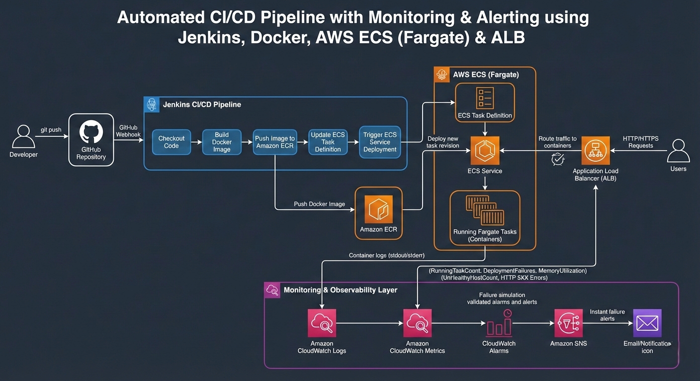

# Automated Monitoring & Logging for Deployment Issues

**AWS ECS (Fargate), CloudWatch, Application Load Balancer**

---

## Table of Contents

1. [Issue Overview](#issue-overview)
2. [Monitoring Design Philosophy](#monitoring-design-philosophy)
3. [Architecture Overview](#architecture-overview)
4. [STEP 1 — Centralized Logging (Foundation)](#step-1--centralized-logging-foundation)
5. [STEP 2 — ECS Monitoring & Alarms](#step-2--ecs-monitoring--alarms)

   * [6.1 Alarm: ECS Tasks Not Running](#61-alarm-ecs-tasks-not-running)
   * [6.2 Alarm: ECS Deployment Failure](#62-alarm-ecs-deployment-failure)
   * [6.3 Alarm: ECS High Memory Usage](#63-alarm-ecs-high-memory-usage)
   * [STEP 2 Final Checklist](#step-2-final-checklist)
6. [STEP 3 — ALB Monitoring (User Impact Detection)](#step-3--alb-monitoring-user-impact-detection)

   * [7.1 Alarm: ALB Unhealthy Targets](#71-alarm-alb-unhealthy-targets)
   * [7.2 Alarm: ALB Target 5XX Errors](#72-alarm-alb-target-5xx-errors)
   * [STEP 3 Final Checklist](#step-3-final-checklist)
7. [STEP 4 — SNS Alerts (Real-Time Notifications)](#step-4--sns-alerts-real-time-notifications)
8. [STEP 5 — Failure Simulation (Validation)](#step-5--failure-simulation-validation)
9. [STEP 6 — Restore Application & Final Wiring](#step-6--restore-application--final-wiring)
10. [Final Verification Checklist](#final-verification-checklist)
11. [Conclusion](#conclusion)

---

## Issue Overview

### What the Issue Was

The system lacked automated, reliable monitoring and alerting for ECS deployments.
Deployments could fail at runtime (task crashes, failed health checks, bad releases) without any immediate signal, even when CI pipelines reported success.

### Why This Is Dangerous

In real-world production environments:

* Jenkins success only confirms that deployment commands executed.
* ECS and ALB determine whether the application is actually running and serving traffic.
* Silent failures lead to prolonged outages, delayed response, and loss of trust.

### What Success Looks Like After the Fix

* All ECS containers stream logs centrally to CloudWatch.
* ECS failures, deployment failures, and resource pressure are detected automatically.
* ALB detects real user impact (unhealthy targets, 5XX errors).
* Critical failures trigger real-time alerts.
* The system is validated through controlled failure simulation.

---

## Monitoring Design Philosophy

### Why Logging Is the Foundation

Monitoring answers *that* something failed.
Logs explain *why* it failed.

Without centralized logs:

* Crashes cannot be diagnosed.
* Deployment failures lack root cause.
* Monitoring signals become noise.

### Why Jenkins Success Does Not Equal Deployment Success

Jenkins:

* Builds images
* Pushes to ECR
* Calls `update-service`

ECS:

* Pulls the image
* Starts the container
* Runs health checks
* Decides if the service stabilizes

Only ECS can confirm runtime success.

### Infrastructure Health vs User Impact

* ECS metrics indicate container health.
* ALB metrics indicate real user experience.

Both are required.

### Mental Model: Desired vs Running Tasks

```
DesiredTaskCount == RunningTaskCount
```

Any sustained mismatch indicates downtime or instability.

---

## Architecture Overview



---

## STEP 1 — Centralized Logging (Foundation)

### Objective

Ensure every ECS container streams logs to CloudWatch so failures always leave evidence.

### ECS Task Definition Log Configuration

```json
"logConfiguration": {
  "logDriver": "awslogs",
  "options": {
    "awslogs-group": "/ecs/<task-name>",
    "awslogs-region": "<region>",
    "awslogs-stream-prefix": "ecs"
  }
}
```

### Why Fargate Requires External Logs

* Tasks are ephemeral
* No SSH access
* Containers may terminate instantly
* Logs must be streamed in real time

### GUI Verification Steps

1. AWS Console → CloudWatch
2. Log groups → `/ecs/<task-name>`
3. Verify log streams:

   ```
   ecs/<container-name>/<random-id>
   ```
4. Confirm logs update when traffic hits the service

### Completion Checklist

* Log group exists
* Log streams created
* Logs visible on requests
* No permission errors

---

## STEP 2 — ECS Monitoring & Alarms

### Purpose

Detect runtime crashes and failed deployments automatically.

### Why ECS Metrics May Be Missing

Service-level metrics require **Container Insights**.
Without it, key metrics do not exist.

### Enable Container Insights (GUI)

1. ECS → Clusters
2. Select cluster → Update cluster
3. Enable Container Insights
4. Update cluster (no downtime)

### Force Metric Emission

* ECS → Service → Update → Update service
* Wait 3–5 minutes for metrics

---

### 6.1 Alarm: ECS Tasks Not Running

**Metric:** `RunningTaskCount`
**Alarm Name:** `ecs-tasks-not-running`

| Setting            | Value           |
| ------------------ | --------------- |
| Statistic          | Minimum         |
| Period             | 60 seconds      |
| Evaluation periods | 2               |
| Threshold          | < Desired count |

---

### 6.2 Alarm: ECS Deployment Failure

**Metric:** `ServiceDeploymentFailures`
**Alarm Name:** `ecs-deployment-failed`

| Setting   | Value |
| --------- | ----- |
| Statistic | Sum   |
| Period    | 60s   |
| Threshold | > 0   |

---

### 6.3 Alarm: ECS High Memory Usage

**Metric:** `MemoryUtilization`
**Alarm Name:** `ecs-high-memory-usage`

| Setting    | Value   |
| ---------- | ------- |
| Statistic  | Average |
| Period     | 60s     |
| Evaluation | 3       |
| Threshold  | ≥ 80%   |

---

### STEP 2 Final Checklist

* Tasks not running alarm
* Deployment failure alarm
* High memory usage warning

---

## STEP 3 — ALB Monitoring (User Impact Detection)

### Why ALB Monitoring Is Required

ECS may report “running” while users experience errors.

---

### 7.1 Alarm: ALB Unhealthy Targets

**Metric:** `UnHealthyHostCount`
**Alarm Name:** `alb-unhealthy-targets`

---

### 7.2 Alarm: ALB Target 5XX Errors

**Metric:** `HTTPCode_Target_5XX_Count`
**Alarm Name:** `alb-target-5xx-errors`

---

### STEP 3 Final Checklist

* Unhealthy target alarm
* Target 5XX error alarm

---

## STEP 4 — SNS Alerts (Real-Time Notifications)

### Why Alerts Matter

Dashboards do not wake engineers. Alerts do.

### SNS Pattern

CloudWatch Alarm → SNS Topic → Notification

---

## STEP 5 — Failure Simulation (Validation)

Monitoring is untrusted until it detects real failure.

Expected results:

* Alarms enter ALARM state
* SNS notification received
* Logs show failure reason

---

## STEP 6 — Restore Application & Final Wiring

* Revert failure
* Redeploy service
* Verify recovery
* Reattach SNS to critical alarms

---

## Final Verification Checklist

* Logs visible in CloudWatch
* ECS alarms functional
* ALB alarms functional
* SNS notifications delivered
* Alarms return to OK after recovery

---

## Conclusion

This implementation delivers a **complete, production-grade monitoring and alerting system** for ECS-based deployments.

It:

* Detects runtime and deployment failures automatically
* Surfaces real user impact
* Sends actionable alerts
* Is validated through controlled failure testing

The GitHub issue is fully resolved using real-world operational standards.

---
